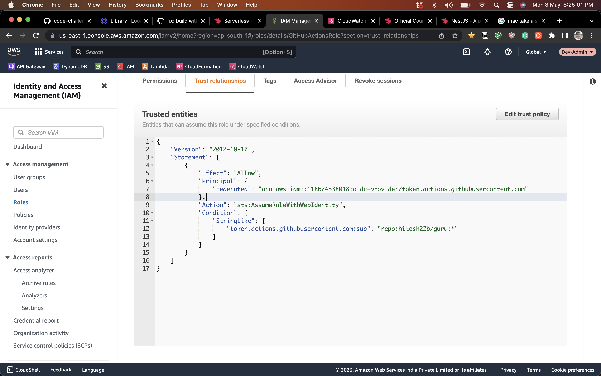

## Description
A simple CRUD application using Serverless framework. In order to bring structure to the codebase i have used it along with Nestjs framework  https://nestjs.com/
## Installation

```bash
$ npm install
```

## Running the app

```bash
# development
$ npm run start

```

## Test

```bash
# unit tests
$ npm run test

# test coverage
$ npm run test:cov
```

## CICD

I am using Github Actions which is given a IAM role provided through an OIDC provider


